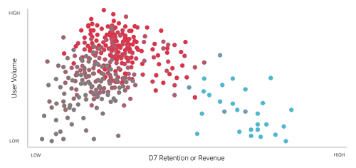
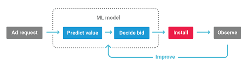

# Audience Pinpointer  
## Overview
Audience Pinpointer is a powerful user acquisition service that uses machine learning to help you find the players most likely to have value beyond the app install. Using dynamic pricing, Audience Pinpointer allows you to bid more for predicted high-value users and less for easy to find users.

### How it works
Unity’s machine-learning model utilizes real-time valuation of the user at the point of an ad request. The algorithm decides on a bid for each user based on individual valuation. The system updates constantly based on actual user behavior and the preferences of millions of users across Unity’s platform.

### Achieve your post-install goals
Audience Pinpointer offers two models to choose from:

* Optimize for retention to acquire users who are more likely to play your game for 7 or more days.
* Optimize for revenue to acquire users based on their predicted spend and maximize return on ad spend (ROAS) during their first 7 days in your game.

## Getting started
Implement Audience Pinpointer in three basic steps:

1. Enable the passing of post-install session and purchase events to Unity.
2. Unity confirms ingestion and validation of events.
3. Contact Unity to set your campaign live.

## Implementation
Dynamic Audience Pinpointer campaigns work very well alongside standard ones, because they each look at different levels of data to optimize.

Audience Pinpointer requires you to pass post-install session events (indicating retention) and in-app purchase events, which allows Unity to dynamically find the right users. The required information depends on your dynamic campaign strategy. 

### Optimizing for retention
This campaign strategy targets users that are likely to remain in your game 7 days after install. Audience Pinpointer uses dynamic pricing so you can pay the right price across the entire user base. This approach has proven to be most successful for games that mainly monetize from ads.

For example:

* Your game’s median D7 Retention is 10%.
* Potential User 1's predicted D7 Retention for your game is 20%, or twice the median.
  * The bid for Potential User 1 is base CPI x2
* Potential User 2's predicted D7 Retention for your game is 5%, or half the median.
  * The bid for Potential User 2 is base CPI x0.5.

#### What Unity needs to run Audience Pinpointer campaigns
In order to make these evaluations, Unity needs data from your players’ post-install game sessions. For more information on how to do this, see documentation on [passing post-install events to Unity](AdvertisingCampaignsPostInstallEvents.md). 

After implementing post-install event passing, contact your account manager or [the Unity Ads team](mailto:unityads-sales@unity3d.com) with the following information: 

* Countries to target
* Baseline bids for each country (these act as your floor for dynamic bidding)
* New campaign names (e.g. appending “Retention” to the standard campaign equivalents’ names) and their budgets

Upon confirming this information, Unity will create the dynamic campaigns from the existing standard ones (including creatives and tracking links), and make them available for you to monitor on the [Acquire dashboard](https://acquire.dashboard.unity3d.com). 

### Optimizing for Revenue
This campaign strategy targets users that are predicted to spend, and uses dynamic bids to acquire them at the right price. Revenue optimization campaigns help you achieve your return on ad spend (ROAS) goals, which is expressed as the revenue a player generates in their first 7 days playing your game, divided by your cost to acquire them.

For maximum impact, Unity recommends running revenue-optimized campaigns alongside retention-optimized campaigns and standard CPI campaigns that optimize towards the best install conversion rates.

For example:

* Your target 7-day ROAS is 10%, meaning a user should spend 10% of the amount you bid to acquire them during their first 7 days in the game.
* Your maximum CPI bid is $20.
* Audience Pinpointer predicts Potential User 1 will generate $1 of revenue during their first 7 days in the game. 
  * The CPI bid for Potential User 1 is $10 ($1 / 0.1 = $10, which is within your maximum bid range).
* Audience Pinpointer predicts Potential User 2 will generate $5 of revenue during their first 7 days in the game.
  * The CPI bid for Potential User 2 is $20 ($5 / 0.1 = $50, which exceeds the $20 maximum bid cap).

#### What Unity needs to run Audience Pinpointer campaigns 
In order to make these evaluations, Unity needs data from your players’ post-install purchase activities. For more information on how to do this, see documentation on [Passing post-install events to Unity](AdvertisingCampaignsPostInstallEvents.md). 

After implementing post-install event passing, contact your account manager with the following information: 

* Your realistic 7-day ROAS target 
* Your actual 7-day ROAS per platform and country 
* Maximum bids (the absolute most you are willing to spend to acquire a high-quality user)
* New campaign names (e.g. appending “ROAS” to the standard campaign equivalents’ names) and their budgets

Upon confirming this information, Unity will create the dynamic campaigns by duplicating the existing standard ones (including creatives and tracking links), and make them available for you to monitor on the [Acquire dashboard](https://acquire.dashboard.unity3d.com). Audience Pinpointer calculates bids based on estimated user value and your day-7 ROAS goal. Nothing changes on the reporting side, as you still get the CPI value per user for each install. You will not pay for the install until it takes place. 

#### Setting ROAS targets and max CPI
Look at the 7-day ROAS you’ve historically achieved with similar static CPI campaigns. The ROAS target should be similar to what you’ve observed so far. If you set the target too high, unrealistic user criteria may limit scale and lead to reduced traffic. In general, the higher your ROAS target, the lower your CPI bids, so setting extremely high ROAS targets yields very low CPI bids that are unlikely to win many impressions. Similarly, because Audience Pinpointer dynamically prices bids based on predicted value, setting low maximum CPI bids can cause you to miss out on high-value users. Low CPI caps typically yield less installs and lower value installs.

Audience Pinpointer predicts 7-day retention and ROAS, so allow at least a full week or two using the provided guidelines to let the data mature before adjusting the target up or down based on campaign performance.

#### Whitelists and Blacklists
Note that Unity clears any whitelisted or blacklisted games for dynamic campaigns, as they are purely optimized towards users. This is considered best practice, but you may speak to your account manager if you wish to retain these lists for your dynamic campaign.