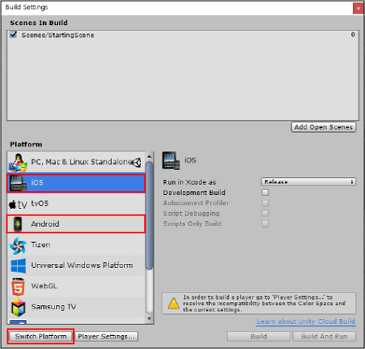

# Basic ads integration for Unity developers
## Overview
This guide covers integration for implementing Unity Ads in your made-with-Unity game.

* If you are an iOS developer using Objective-C, [click here](MonetizationBasicIntegrationIos.md).
* If you are an Android developer using Java, [click here](MonetizationBasicIntegrationAndroid.md). 
* [Click here](../api/UnityEngine.Advertisements.html) for the C# `Advertisements` API reference.

**Note**: If you only intend to implement video, interstitial, and banner ads for your monetization strategy, Unity recommends using the [`Advertisements`](../api/UnityEngine.Advertisements.html) API for a simpler integration experience. However, if you plan to implement [Personalized Placements](MonetizationPersonalizedPlacementsUnity.md), you must integrate Unity Ads with the [`Monetization`](../api/UnityEngine.Monetization.html) API. For more information, please see the [**Integration for Personalized Placements**](#integration-for-personalized-placements) section. 

### Guide contents
* [Configuring your Project](#configuring-your-project)
    * [Setting your build targets](#setting-build-targets)
    * [Installing the SDK](#installing-unity-ads)
* [Creating a Placement](#creating-a-placement)
* [Script implementation](#script-implementation)
    * [Initializing the SDK](#initializing-the-sdk)
    * [Interstitial ads](#interstitial-display-ads)
    * [Rewarded video ads](#rewarded-video-ads)
* [Integration for Personalized Placements](#integration-for-personalized-placements)
* [Testing your implementation](#testing)

## Configuring your Project
### Setting build targets
Configure your Project for a supported platform using the [Build Settings window](https://docs.unity3d.com/Manual/BuildSettings.html). Set the platform to **iOS** or **Android**, then click **Switch Platform**.



### Installing Unity Ads
To ensure the latest version of Unity Ads, download it through the Asset store, or through the Unity Package Manager in the Editor.

**Important**: You must choose either the Asset or the package. Installing both may lead to build errors.

#### Using the Asset package
[Download](https://assetstore.unity.com/packages/add-ons/services/unity-ads-66123) the latest version of Unity Ads from the Asset store. For information on downloading and installing Asset packages, see [Asset packages documentation](https://docs.unity3d.com/Manual/AssetPackages.html). 

#### Using Package Manager
Install the latest version of Unity Ads through the [Unity Package Manager](https://docs.unity3d.com/Manual/upm-ui.html), by following these steps:

1. In the Unity Editor, select **Window** > **Package Manager** to open the Package Manager.
2. Select the **Advertisements** package from the list, then select the most recent verified version.
3. Click the **Install** or **Update** button.

## Creating a Placement
[Placements](MonetizationPlacements.md) are triggered events within your game that display monetization content. Manage Placements from the **Operate** tab of the [developer dashboard](https://operate.dashboard.unity3d.com/) by selecting your Project, then selecting **Monetization** > **Placements** from the left navigation bar.

Click the **ADD PLACEMENT** button to bring up the Placement creation prompt. Name your Placement and select its type:

* Select **Non-rewarded** to show basic interstitial ads or promotional content. Non-rewarded Placements allow players to skip the ad after a specified period of time.
* Select **Rewarded** to allow players to opt-in to viewing ads in exchange for incentives. Rewarded Placements do not allow the player to skip the ad.
* Select **Banner** to create a dedicated Banner ad Placement. 

Every Unity Ads-enabled project has a (non-rewarded) ‘`video`’ and (rewarded) ‘`rewardedVideo`’ Placement by default. Feel free to use one of these for your first implementation if they suit your needs, or create your own.

## Script implementation
### Initializing the SDK
To initialize the SDK, you must reference your Project’s Game ID for the appropriate platform. You can locate the ID on the **Operate** tab of the [Developer Dashboard](https://operate.dashboard.unity3d.com/) by selecting the Project, then selecting **Settings** > **Project Settings** from the left navigation bar (see the [Dashboard guide](MonetizationResourcesDashboardGuide.md#project-settings) section on **Project Settings** for details). 

In your game script header, include the [`UnityEngine.Advertisements`](../api/UnityEngine.Advertisements.html) namespace. Initialize the SDK early in the game’s run-time life cycle, preferably at launch, using the [`Advertisement.Initialize`](../api/UnityEngine.Advertisements.Advertisement.html) function. For example:

```
using UnityEngine;
using UnityEngine.Advertisements;

public class InitializeAdsScript : MonoBehaviour { 

    string gameId = "1234567";
    bool testMode = true;

    void Start () {
        Advertisement.Initialize (gameId, testMode);
    }
}
```

### Interstitial display ads
To display a full-screen interstitial ad using the [`Advertisements`](../api/UnityEngine.Advertisements.html) API, simply initialize the SDK and use the [`Advertisement.Show`](../api/UnityEngine.Advertisements.Advertisement.html) function. For example:

```
using UnityEngine;
using UnityEngine.Advertisement;

public class InterstitialAdsScript : MonoBehaviour { 

    string gameId = "1234567";
    bool testMode = true;

    // Initialize the Ads service:
    void Start () {
        Advertisement.Initialize (gameId, testMode);
    }

    // Show an ad:
    Advertisement.Show ();
}
```

### Rewarded video ads
Rewarding players for watching ads increases user engagement, resulting in higher revenue. For example, games may reward players with in-game currency, consumables, additional lives, or experience-multipliers. For more information on how to effectively design your rewarded ads, see documentation on [Ads best practices](MonetizationResourcesBestPracticesAds.md).

To reward players for completing a video ad, implement a callback method using the [`ShowResult`](../api/UnityEngine.Advertisements.ShowResult.html) result to check if the user finished the ad and should be rewarded. For example:

```
using UnityEngine;
using UnityEngine.Advertisements;

public class RewardedAdsScript : MonoBehaviour, IUnityAdsListener { 

    string gameId = "1234567";
    myPlacementId = “rewardedVideo”;
    bool testMode = true;

    // Initialize the Ads listener and service:
    void Start () {
        Advertisement.AddListener (this);
        Advertisement.Initialize (gameId, testMode);
    }

    // Implement IUnityAdsListener interface methods:
    public void OnUnityAdsDidFinish (string placementId, ShowResult showResult) {
        // Define conditional logic for each ad completion status:
        if (showResult == ShowResult.Finished) {
            // Reward the user for watching the ad to completion.
        } else if (showResult == ShowResult.Skipped) {
            // Do not reward the user for skipping the ad.
        } else if (showResult == ShowResult.Failed) {
            Debug.LogWarning (“The ad did not finish due to an error.);
        }
    }
    
    public void OnUnityAdsReady (string placementId) {
        // If the ready Placement is rewarded, show the ad:
        if (placementId == myPlacementId) {
            Advertisement.Show (myPlacementId);
        }
    }

    public void OnUnityAdsDidError (string message) {
        // Log the error.
    }

    public void OnUnityAdsDidStart (string placementId) {
        // Optional actions to take when the end-users triggers an ad.
    } 
}
```

#### Rewarded video ad buttons
Using a button to allow the player to opt in to watching an ad is a common implementation for rewarded video ads. Use the example code below to create a rewarded ads button. The ads button displays an ad when pressed, as long as ads are available. To configure the button in the Unity Editor:

1. Select **Game Object** > **UI** > **Button** to add a button to your Scene.
2. Select the button you added to your Scene, then add a script component to it using the Inspector (**Add Component** > **New Script**). Name the script `RewardedAdsButton` to match the class name.
3. Open the script and add the following code:

``` 
using UnityEngine;
using UnityEngine.UI;
using UnityEngine.Advertisements;

[RequireComponent (typeof (Button))]
public class RewardedAdsButton : MonoBehaviour, IUnityAdsListener {
    
    #if UNITY_IOS
    private string gameId = "1486551";
    #elif UNITY_ANDROID
    private string gameId = "1486550";
    #endif
    
    Button myButton;
    public string myPlacementId = "rewardedVideo";

    void Start () {   
        myButton = GetComponent <Button> ();

        // Set interactivity to be dependent on the Placement’s status:
        myButton.interactable = Advertisement.IsReady (myPlacementId); 
        
        // Map the ShowRewardedVideo function to the button’s click listener:
        if (myButton) myButton.onClick.AddListener (ShowRewardedVideo);
        
        // Initialize the Ads listener and service:
        Advertisement.AddListener (this);
        Advertisement.Initialize (gameId, true);
    }

    // Implement a function for showing a rewarded video ad:
    void ShowRewardedVideo () {
        Advertisement.Show (myPlacementId);
    }

    // Implement IUnityAdsListener interface methods:
    public void OnUnityAdsReady (string placementId) {
        // If the ready Placement is rewarded, activate the button: 
        if (placementId == myPlacementId) {        
            myButton.interactable = true;
        }
    }

    public void OnUnityAdsDidFinish (string placementId, ShowResult showResult) {
        // Define conditional logic for each ad completion status:
        if (showResult == ShowResult.Finished) {
            // Reward the user for watching the ad to completion.
        } else if (showResult == ShowResult.Skipped) {
            // Do not reward the user for skipping the ad.
        } else if (showResult == ShowResult.Failed) {
            Debug.LogWarning (“The ad did not finish due to an error.”);
        }
    }

    public void OnUnityAdsDidError (string message) {
        // Log the error.
    }

    public void OnUnityAdsDidStart (string placementId) {
        // Optional actions to take when the end-users triggers an ad.
    } 
}
```

## Integration for Personalized Placements
Unity’s monetization platform provides you with powerful revenue tools. If your game uses in-app purchases as well as ads, Unity’s machine learning data model can seamlessly blend content types for an optimized monetization strategy. To learn more about how Unity helps you optimize revenue, see documentation on Personalized Placements.

The Unity Ads integration for Personalized Placements is slightly different, as it requires the [`Monetization`](../api/UnityEngine.Monetization.html) API instead of the `Advertisements` API.

### Initialization
In your game script header, include the `UnityEngine.Monetization` namespace. Initialize the SDK early in the game’s run-time life cycle, preferably at launch, using the [`Monetization.Initialize`](/api/UnityEngine.Monetization.Monetization.html) function. For example:

```
using UnityEngine.Monetization;

public class UnityAdsScript : MonoBehaviour { 

    string gameId = "1234567";
    bool testMode = true;

    void Start () {
        Monetization.Initialize (gameId, testMode);
    }
}
```

### Implementing basic (non-rewarded) ads
[`PlacementContent`](../api/UnityEngine.Monetization.PlacementContent.html) is an object representing monetization content that your Placement can display (for more information, see documentation on [Content types](MonetizationContentTypes.md) and [Personalized Placements](MonetizationPersonalizedPlacementsUnity.md)). Use the `Monetization.GetPlacementContent` function to retrieve content when it’s ready to display, and its [`Show`](../api/UnityEngine.Monetization.ShowAdPlacementContent.html) function to display it. For example:

```
using UnityEngine.Monetization;

public class UnityAdsPlacement : MonoBehaviour {

    public string placementId = "video";

    public void ShowAd () {
        StartCoroutine (ShowAdWhenReady ());
    }

    private IEnumerator ShowAdWhenReady () {
        while (!Monetization.IsReady (placementId)) {
            yield return new WaitForSeconds(0.25f);
        }

        ShowAdPlacementContent ad = null;
        ad = Monetization.GetPlacementContent (placementId) as ShowAdPlacementContent;

        if(ad != null) {
            ad.Show ();
        }
    }
}
```

In this example, the coroutine checks the passed Placement ID for available `PlacementContent` using the [`Monetization.IsReady`](../api/UnityEngine.Monetization.Monetization.html) property. If content is available, it’s stored as a variable and executed with its [`Show`](../api/UnityEngine.Monetization.ShowAdPlacementContent.html) function. 

### Implementing rewarded ads
Rewarding players for watching ads increases user engagement, resulting in higher revenue. For example, games may reward players with in-game currency, consumables, additional lives, or experience-multipliers. For more information on how to effectively design your rewarded ads, see documentation on [ads best practices](MonetizationResourcesBestPracticesAds.md).

To reward players for watching ads, follow the same steps as detailed in the basic implementation section, but show the ad using a reward callback method with custom logic for players completing the ad.

#### Selecting a Placement
You must display rewarded ads through [Rewarded Placements](MonetizationPlacements.md#placement-types). Every Unity Ads-enabled Project also has a `'rewardedVideo'` Placement by default. Feel free to use this for your implementation, or [create your own](MonetizationPlacements.md#creating-new-placements) (but make sure your Placement is configured as Rewarded).

#### Adding a callback method to your script
The `Show` function accepts a callback that the SDK uses to return a [`ShowResult`](../api/UnityEngine.Monetization.ShowResult.html) enum. This result indicates whether the player finished or skipped the ad. Use this information to write a custom function for how to handle each scenario. For example: 

```
using UnityEngine.Monetization;

public class RewardedAdsPlacement : MonoBehaviour {

    public string placementId = "rewardedVideo";

    public void ShowAd () {
        StartCoroutine (WaitForAd ());
    }

    IEnumerator WaitForAd () {
        while (!Monetization.IsReady (placementId)) {
            yield return null;
        }

        ShowAdPlacementContent ad = null;
        ad = Monetization.GetPlacementContent (placementId) as ShowAdPlacementContent;

        if (ad != null) {
            ad.Show (AdFinished);
        }
    }

    void AdFinished (ShowResult result) {
        if (result == ShowResult.Finished) {
            // Reward the player
        }
    }
}
```

#### Rewarded ads button code example
Rewarded ads usually use a button that prompts players to opt in to watching the ad. The following describes how to create a rewarded ads button that displays an ad when pressed, as long as content is available.

1. In the Unity Editor, select **Game Object** > **UI** > **Button** to add a Button to your Scene.
2. With the Button selected, in the Inspector, click **Add Component** > **New Script** to add a script component to it. Name the script `UnityAdsButton` to match the class name.
3. Open the script and add the following example code: 

```
using UnityEngine;
using UnityEngine.UI;
using UnityEngine.Monetization;

[RequireComponent (typeof (Button))]
public class UnityAdsButton : MonoBehaviour {

    public string placementId = "rewardedVideo";
    private Button adButton;

#if UNITY_IOS
   private string gameId = "1234567";
#elif UNITY_ANDROID
    private string gameId = "7654321";
#endif

    void Start () {
        adButton = GetComponent<Button> ();
        if (adButton) {
            adButton.onClick.AddListener (ShowAd);
        }

        if (Monetization.isSupported) {
            Monetization.Initialize (gameId, true);
        }
    }
  
    void Update () {
        if (adButton) {
            adButton.interactable = Monetization.IsReady (placementId);
        }
    }

    void ShowAd () {
        ShowAdCallbacks options = new ShowAdCallbacks ();
        options.finishCallback = HandleShowResult;
        ShowAdPlacementContent ad = Monetization.GetPlacementContent (placementId) as ShowAdPlacementContent;
        ad.Show (options);
    }

    void HandleShowResult (ShowResult result) {
        if (result == ShowResult.Finished) {
            // Reward the player
        } else if (result == ShowResult.Skipped) {
            Debug.LogWarning ("The player skipped the video - DO NOT REWARD!");
        } else if (result == ShowResult.Failed) {
            Debug.LogError ("Video failed to show");
        }
    }
}
```

**Note**: This example checks at a specific point in the game whether Placement content is ready to display. As an alternate method, you can implement a listener to notify you when content is available.

## Testing
Prior to publishing your game, enable test mode by following these steps: 

1. From the **Operate** tab of the [Developer Dashboard](https://operate.dashboard.unity3d.com/), select your Project.
2. Select **Monetization** > **Platforms** from the left navigation bar.
3. Select the desired platform, then select the **SETTINGS** tab.
4. Scroll down to the **TEST MODE** section and toggle override client test mode, then select the **Force test mode ON** radio button.

In the Unity Editor, click the play button to run your Project and test your ads implementation.

**Note**: You must enable test mode before testing ads integration, to avoid getting flagged for fraud.

## What's next?
Take your implementation to the next level by using Unity's additional monetization features to optimize your revenue. Here are some next steps to explore:

* Incorporate other ad content types.
    * View documentation for [banner ads integration](MonetizationBannerAdsUnity.md).
    * View documentation for [AR ads integration](MonetizationArAdsUnity.md).
* Incorporate in-app purchases (IAP), then promote them.
    * If you haven't implemented IAP, create an in-app store with [Unity IAP](https://docs.unity3d.com/Manual/UnityIAP.html).
    * If you already have, implement [IAP Promo](https://docs.unity3d.com/Manual/IAPPromo.html) to promote your in-app offers.
* Let machine learning power your monetization strategy.
    * When you have Ads and IAP Promo set up, use [Personalized Placements](MonetizationPersonalizedPlacementsUnity.md) to provide revenue lift for your entire game.
* Review our [best practices](MonetizationResourcesBestPracticesAds.md) guide for insight on how to design effective ad mechanics.