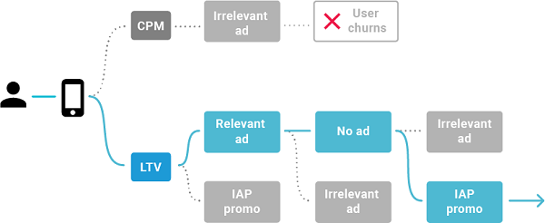

# Introduction to Personalized Placements  
A Personalized Placement is the decision engine that ties together ads and in-app purchase IAP promotions, determining which format to serve based on player experience and impact to lifetime value (LTV). Each player receives the most meaningful engagements to maximize retention and revenue. Simply add [IAP Promos](https://docs.unity3d.com/Manual/IAPPromo.html) to your rewarded or non-rewarded video ad [Placements](MonetizationPlacements.md) to increase their performance.

## How it works  
__Personalized Placements__ optimize toward LTV for retention and sustainable revenue. Unity calculates the LTV of your users by projecting their total potential value over an infinite amount of time. The data model analyzes many factors to predict the LTV of monetization content relative to your user, not just the bid price. These data points include, but are not limited to, the likelihood of the player returning to the app, and the likelihood of churn, app usage, historical ad preference, genre preference, and propensity for in-app purchases. 

 

The machine learning engine also benefits from being trained on all available data since the inception of the experiment. When a Personalized Placement requests content, its machine learning engine assigns an LTV score to each format, whether it’s an ad bid or IAP Promo. The format with the highest LTV score wins the impression.  

## Measuring success
To maximize profits with Personalized Placements, you follow a two-phase rollout process:

1. **Observation** In the observation phase, Unity segments your users so that half receive optimized content, while the other half acts as a control group. This allows you to easily determine the optimization effects and make educated decisions about how to proceed.
2. **Scale** When you’ve observed significant results (typically after roughly one month of data), you’ll enter the scaling phase. During this phase, Unity maximizes the number of users experiencing optimization, in order to maximize your revenue. 

Because __Personalized Placements__ work holistically to optimize your revenue, it’s important to ensure that your game’s overall economy and monetization strategy is healthy and effective to begin with. Unity’s machine learning model can dynamically adjust to your user’s preferences, to provide the best experience for each individual user. But if the underlying setup of your app or game is ineffective at driving monetization, the revenue lift will be smaller. This is especially important because the player’s journey, behavior, and creatives they experience directly impact the Personalized Placement’s valuations and choices.  

## Getting started
This section walks you through successful implementation in three phases: 

1. **Prepare** Read the pre-integration section if you’re new to monetization design strategy and looking for guidance on implementing an effective monetization system.
    * [Prepare for integration](MonetizationPersonalizedPlacementsPrep.md)
2. **Integrate** Read the integration section when you’re confident in your monetization design strategy and ready to execute on it by implementing Personalized Placements in your game.
    * [Made with Unity (C#)](MonetizationPersonalizedPlacementsUnity.md)
    * [iOS (Objective-C)](MonetizationPersonalizedPlacementsIos.md)
    * [Android (Java)](MonetizationPersonalizedPlacementsAndroid.md)
3. **Scale** Read the post-integration section when your game has been published long enough to observe and act on performance results to drive revenue higher.
    * [Scale for success](MonetizationPersonalizedPlacementsScale.md) 

If you have any questions, contact your Unity representative or [review the FAQ](MonetizationResourcesFaq#personalized-placements-faqs). 