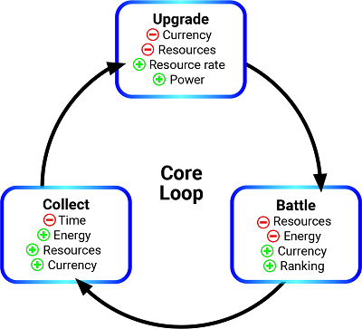
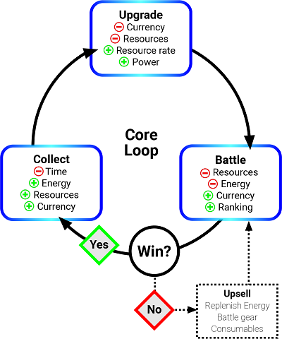
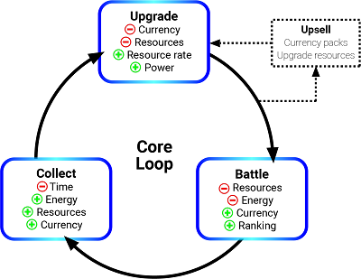

# Pre-integration steps: define your monetization strategy 
Before implementing Personalized Placements, it's important to clearly define your monetization strategy. If you need help getting started, Unity recommends these steps: 

1. Identify your game’s core loop. 
2. Identify surfacing points that will entice players to enhance their experience. 
3. Identify player archetypes engaging with your game, and create [Promos](https://docs.unity3d.com/Manual/IAPPromo.html) that target them. 

## Define your game’s core loop 
Your core loop is the fundamental sequence of activities a player follows and repeats throughout your game. These vary depending on the game and genre, but usually involve acquiring and spending resources to progress in the game. Your core loop is the mechanic that keeps players engaged with your content and incentivized to play. The steps between each activity in the core loop present the most fertile monetization opportunities.  

Here is an abstract example of a core game loop: 

## Identify surfacing points that will entice players to enhance their experience 
Natural breaks in gameplay or friction points occur between the phases of your core loop. These are surfacing points, and excellent locations to implement [Placements](MonetizationPlacements.md) because they present the player with choices or information without interrupting gameplay. 

When identifying these opportunities, remember that similar surfacing points can occur in multiple locations, so you can use a single Placement in multiple surfacing points throughout your game. For example, you can use the same Placement anywhere a player loses a life, levels up, or defeats a boss. 

You can further augment these surfacing points by implementing [Standard Events](https://docs.unity3d.com/Manual/UnityAnalyticsStandardEvents.html) that provide more context into in-game milestones of the player, which provides better data for machine learning-driven decisions (for more information, see section on implementing Standard Events in your platform's integration guide). These will ultimately be where you implement your Placements. 

### Common examples of surfacing points 
Personalized Placements serve both ad and Promo content. Unity strongly recommends using rewarded ads in your implementation, and reviewing the [rewarded video best practices guide](MonetizationResourcesBestPracticesAds.md). Context is important. When considering these examples, think about what incentives make enticing rewards for each surfacing point if an ad wins the impression. 

#### Level complete 
Level transitions present a natural pause to display an ad or Promo without disrupting gameplay, and might be a good opportunity to reward or promote items that will help players with the upcoming challenge.  

#### Level failed or player death 
Failing a challenge presents both a break in gameplay and a friction point, where the player might be interested in extra lives or power-ups that improve their chances of success on the next attempt.   

 

#### Level-up 
Leveling up often results in access to increased power or resources. This may present an opportunity to entice a non-paying player with a discounted purchase offer, or the option to watch an ad in exchange for a period of double rewards. 

 

#### In-game store menu 
Shops are resource sinks, and therefore good opportunities for rewarded Placements offering currency in exchange for watching an ad, or Promos for currency packs. 

### Create Products and Promos based on player archetypes 
#### Who plays your game? 
Now that you have a strategy for surfacing ads and Promo campaigns, consider the types of players engaged with your game. This helps inform the types of in-app purchases you want to promote. Consider the following example archetypes: 
 
* The "completionist" player desires resources to collect and craft the best items. 
* The "pitstop" player’s most valued resource is time, and therefore wants to speed things up and eliminate waiting. 
* The "conqueror" player enjoys raiding, battling, and competition. They are typically willing to pay for power. 

#### What do they want? 
Understanding your game’s audience helps identify what products they might desire. Remember, you don’t have to worry about matching the right player with the right offer, because the machine learning will do that for you. However, it’s important to account for every play style in your player base when choosing the types of Promos you’ll run. 

For example, using the archetypes listed above, you might end up with a Promo strategy that looks like this: 

| **Player archetypes** | **Products** | **Promos** |
| --------------------- | ------------ | ---------- | 
| Completionist | Focus on collectable or crafting items, and unique non-consumables such as vanity items or skins.  <ul><li>Soft currency</li><li>Crafting resources</li><li>Unique skins</li></ul> | <ul><li>100 Gems ($0.99)</li><li>500 Gems ($4.99)</li><li>2000 Gems ($19.99)</li><li>2000 Gem Starter Pack ($9.99 for non-payers only)</li><li>2000 Gem Sale ($14.99 for a limited time only)</li><li>Crafting Pack (500 Gems, 10 Wood, 20 Nails, 1 Hammer, $9.99)</li><li>Crafting Starter Pack (500 Gems, 10 Wood, 20 Nails, 1 Hammer, $4.99 for non-payers only)</li><li>Thor’s Crafting Hammer ($9.99 for a limited time only) |
| Pitstop | Focus on consumable items that speed up ability to progress in the game.  <ul><li>Accelerators</li><li>Energy refills</li><li>XP boosts</li></ul> | <ul><li>Plant Growth Stimulant ($0.99)</li><li>Plant Growth Stimulant x6 ($4.99)</li><li>Plant Growth Stimulant x25 ($19.99)</li><li>Plant Growth Stimulant x25 Starter Pack ($9.99 for non-payers only)</li><li>Plant Growth Stimulant x25 Sale ($14.99 for a limited time only)</li><li>Booster Pack (Double XP Boost, Double Gems Boost, Plant Growth Stimulant x5, Coffee x5, $9.99)</li><li>Booster Starter Pack (Double XP Boost, Double Gems Boost, Plant Growth Stimulant x5, Coffee x5, $4.99 for non-payers only) |
| Conqueror | Focus on items that increase power, or vanity items that distinguish the player from their peers.  <ul><li>Weapons</li><li>Armor</li><li>Consumables | <ul><li>Flame Blade ($4.99)</li><li>Flame Tunic ($4.99)</li><li>Inferno Blade ($9.99)</li><li>Inferno Mail ($9.99)</li><li>Phoenix Blade ($19.99)</li><li>Phoenix Robe ($19.99)</li><li>Phoenix Set (Phoenix Blade and Phoenix Robe, $34.99)</li><li>Phoenix Starter Set (Phoenix Blade and Phoenix Robe, $24.99 for non-payers only)</li><li>Phoenix Set Sale (Phoenix Blade and Phoenix Robe, $29.99 for a limited time only)</li><li>Inferno War Chest (Inferno Blade, Inferno Mail, Stamina Potion x5, Strength Potion x5, $19.99)</li><li>Inferno Starter Pack (Inferno Blade, Inferno Mail, Stamina Potion x5, Strength Potion x5, $9.99 for non-payers only) |

How you choose to organize your Promos is up to you. In this example, the Promos are organized around several campaign types:  
 
* **Evergreen**: Persistent content that is always available at a consistent price point. 
* **Non-payer**: Single-use discounts only available to players who have not spent money in the game. 
* **Limited-time**: Discounted items available to the entire player base, but only between specified dates. 

**Note**: You can configure non-payer and limited-time offers in the final step of the [IAP Promo creation process](https://docs.unity3d.com/Manual/IAPPromoPromotions.html) (targeting and scheduling). Unity generally discourages including discounted items in Personalized Placement Promos, as it can skew the machine-learning data towards sale items, but non-payer and limited-time offers work well because the model excludes them from consideration when the player is ineligible for those offers.     

For more ideas on how to design effective Promo campaigns, see the [IAP Promo monetization tips](MonetizationResourcesBestPracticesPromo.md). 

## What's next?
View the Personalized Placements integration guide for your development platform:

* [Made with Unity (C#)](MonetizationPersonalizedPlacementsUnity.md)
* [iOS (Objective-C)](MonetizationPersonalizedPlacementsIos.md)
* [Android (Java)](MonetizationPersonalizedPlacementsAndroid.md)

These guides cover implementation. You’ll create Placements at the surfacing points you identified, then tie your Promos to them. Don’t worry about targeting specific user segments with specific offers. As long as you’ve covered your bases by providing offers that will appeal to different players in different situations, Unity’s data model will determine which offer best resonates with each individual player. 

Unity recommends multiple Personalized Placements in your game, to give the player a consistent experience throughout the game, as opposed to only occasionally receiving optimized content. Benchmarking across the industry suggests that users prefer 1 or 2 impressions per day. When choosing which Promos to associate with each Placement, consider the game event occurring, and what offers might entice players in that situation. 

With your monetization strategy set, you’re ready to implement Personalized Placements in your game.