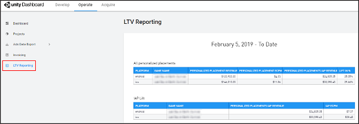

# Scaling to maximize value 
As every game is unique, Unity strives to ensure that you’re comfortable with the performance of Personalized Placements in your game before optimizing the experience of your entire player base. This rollout consists of two phases: [observation](#what-to-expect-in-the-observation-phase) and [scaling](#what-to-expect-in-the-scaling-phase). 

## LTV reporting 
When your Personalized Placements are live, Unity monitors phase one performance and enables an **LTV Reporting** tab on the Operate dashboard when statistically significant data is available. The report will appear on the left navigation bar of your Organization-level menu.   

This report lets you view how Personalized Placements impact your revenue and retention. It includes analytics for eCPM lift, revenue lift, and average revenue per daily active user (ARPDAU).

**Note**: During the beta period, the LTV reporting period defaults to performance over the past 30 days, which allows for statistically significant results.  

## What to expect in the observation phase  
* Unity randomly assigns half of your users to an exposed group, while the other half constitutes a control group. The exposed users will experience content optimization, while the control group will not, to clearly demonstrate the difference in performance. 
* As Unity collects data on the preferences of every user in the Unity network (even those who have just entered your game), you will generally see an immediate impact to your game.  
* The observation phase typically lasts about a month, to generate statistically significant results. During this period, you will likely see a revenue impact within the first week of Placement conversion. However, to ensure solid data-driven decisions, Unity refrains from scaling optimized content to all users until the significance of that impact is clear. 

 **Note**: The number of active Personalized Placements, size of your game, and complexity of its economy will heavily influence the actual length of the observation period. Unity recommends personalizing as many of your Placements as possible to improve the data sampling. 

## What to expect in the scaling phase  
* Once you’ve accrued sufficient data, Unity adjusts the distribution of users to 90% exposed and 10% control. This allows Unity to maximize your revenue and still demonstrate the effect of optimization on your users. 
* After this change, your revenue lift will be projected by normalizing the data of both groups, so Unity can compare the results from two differently-sized experiment populations correctly.  

During the beta, your account manager will work closely with you to handle the transition between phases. Your dashboards will change automatically, adjusting to the new optimization settings. 

**Note**: If you use ads [mediation](MonetizationResourcesMediation.md), Unity is working to allow your mediation platform (e.g. Admob and Mopub) to correctly utilize the additional revenue you receive from our optimization in their autoranking of your meditation waterfall. This will be available in the near future, and allow you to correctly rank Unity against other monetization partners automatically.

## What's next?
Review our extensive [Monetization resources](MonetizationResources.md), or [return](Monetization.md) to the monetization hub.