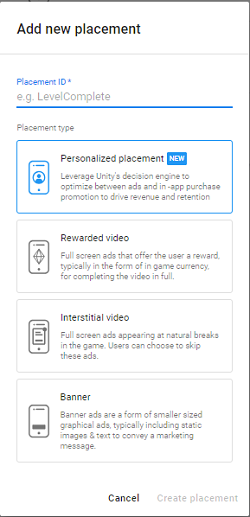
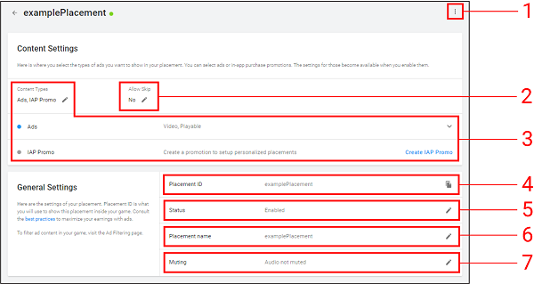
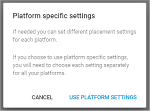

# Placements
## Overview
Placements are triggered events within your game that display monetization content. In this guide, you’ll learn how to configure, implement, and personalize Placements. 

## Managing Placements
Manage Placements from the developer dashboard:

1. From the **Operate** tab of the [developer dashboard](https://operate.dashboard.unity3d.com/), select your Project.
2. Select **Monetization** from the left navigation bar to view a list of your Project's monetization options.
3. Select **Placements** to manage and create ad Placements.

## Creating new Placements
To create a new **Placement**, click **ADD PLACEMENT** to open the **Add new placement** configuration window.

The **Placement name** you specify auto-generates a __Placement ID__, which you call in your code implementation. Note that you can change Placement name later, but once you create the Placement, you cannot change the corresponding ID.

### Placement types
When creating a new Placement, you must define its type:

* Select **Personalized Placements** to display both ads and in-app purchasing promotions, using machine learning-driven decisions about which to serve based on each player’s preferences and predictive LTV. 
* Select **Non-rewarded** to show basic interstitial ads or promotional content. Non-rewarded Placements allow players to skip the ad after a specified period of time.
* Select **Rewarded** to allow players to opt-in to viewing ads or promotions in exchange for incentives. Rewarded Placements do not allow the player to skip the ad.
* Select **Banner** to create a dedicated Banner ad Placement. 

**Note**: Each Unity Ads-enabled Project includes two default __Placements__ for your convenience:

* ‘`video`’ is a non-rewarded Placement that serves [video ad](MonetizationContentTypes.md#video-ads) and [playable ad](MonetizationContentTypes.md#playable-ads) formats, and allows users to skip the ad after 5 seconds.
* ‘`rewardedVideo`’ is a rewarded Placement that serves [video ad](MonetizationContentTypes.md#video-ads) and [playable ad](MonetizationContentTypes.md#playable-ads) formats, but does not allow skipping.

Our [best practices guide](MonetizationResourcesBestPracticesAds.md) provides examples of effective implementation of ad placements. 

Click **CREATE NEW PLACEMENT** to configure the Placement’s settings.

### Placement settings
You can edit Placement settings at any time by selecting the desired Placement from the **Placements** menu on the dashboard.

The available settings are defined below.

#### 1. Platform-specific settings
To configure settings specific to each platform (iOS and Android), click the Options icon in the upper-right corner of the settings menu, then click **Platform specific settings**.

Once you enable platform-specific settings, you must configure separate settings for each platform.

#### 2. Allow Skip
Click the Edit icon to specify the number of seconds after which users can skip ads in this Placement. 

**Tip**: To run [rewarded ads](MonetizationResourcesBestPracticesAds.md#rewarded-ads) in your Placement, set this option to **No** so that the video is not skippable.

#### 3. Content Types
Choose **Ads**, **IAP Promo**, or both. 

With **Ads** enabled, you may select the following formats to display:

* __Video ads__ are full screen video advertisements.
* __Display ads__ are full screen static images.
* __Playable ads__ are full screen interactive advertisements.

With IAP Promo enabled, you can link Promos to the Placement, or click **Create IAP Promo** (for more information, see documentation on [IAP Promo integration](https://docs.unity3d.com/Manual/IAPPromo.html)). Note that IAP Promos must be enabled and linked in order to activate Personalized Placements.

#### 4. Placement ID
A Placement ID is a unique identifier to reference in your code implementation. Once you create the Placement, you cannot change its corresponding ID.

#### 5. Status
By default, a new Placement's status is **Live**. Click the Edit icon, then uncheck **Enable Placement** and click **SAVE** to change its status to **Disabled**. Disabled Placements will not show monetization content.

#### 6. Placement Name
Click the Edit icon to change the Placement name. Changing this setting does not impact the Placement ID.

**Note**: The Developer Dashboard does not currently support self-serve [AR ads](MonetizationContentTypes.md#ar-ads) or [Cross-Promotions](MonetizationCrossPromotions.md) in Placements.

#### 7. Muting
By default, ads for a new Placement are not muted. If you want ads in this Placement to default to muted audio, click the Edit icon, then check **Mute audio**.

#### Refresh rate (Banner Placements only)
The number of seconds between refresh attempts for banner ad content.

## Implementing Placements in-game
Implementing Placements in your game is a 3-step process:

1. Initialize the Unity Ads SDK early in the game’s run-time lifecycle, preferably at launch. Unity recommends using the latest SDK (3.0+). 
2. In your code, check if Placement content is ready to display through your specified Placement.
3. Retrieve the available content and display it.

For comprehensive code integration instructions, read the documentation for your development platform:

* [Unity developers (C#)](MonetizationBasicIntegrationUnity.md)
* [iOS developers (Objective-C)](MonetizationBasicIntegrationIos.md)
* [Android developers (Java)](MonetizationBasicIntegrationAndroid.md)

## Personalized Placements
Personalized Placements optimize player experiences and lifetime value on an individual basis. Each player receives the most meaningful engagements to maximize player retention and revenue. Add high value in-game IAP promotions into your rewarded or non-rewarded Placement to supercharge your monetization performance. Unity’s machine learning algorithms show either your IAP offer or a video advertisement based on the highest predicted player LTV.

[Watch an example video](https://www.youtube.com/watch?v=6FfwECid9Yg) that showcases rewarded Personalised Placements.

For a comprehensive guide to implementing effective Personalized Placements, review the integration guide for your development platform:

* [Personalized Placements for games made with Unity (C#)](MonetizationPersonalizedPlacementsUnity.md)
* [Personalized Placements for iOS developers (Objective-C)](MonetizationPersonalizedPlacementsIos.md)
* [Personalized Placements for Android developers (Java)](MonetizationPersonalizedPlacementsAndroid.md)