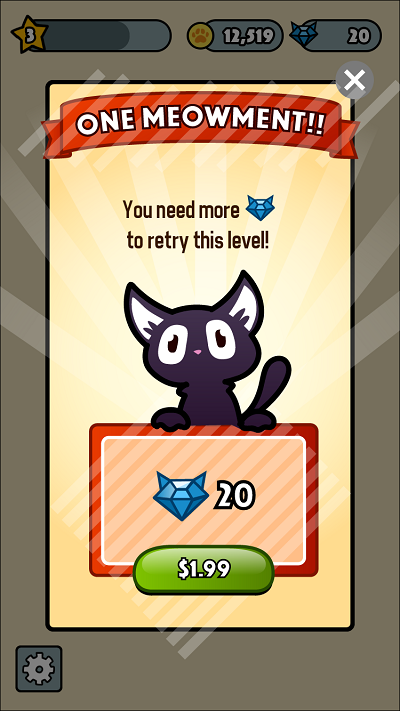
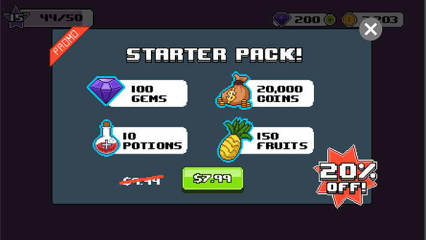
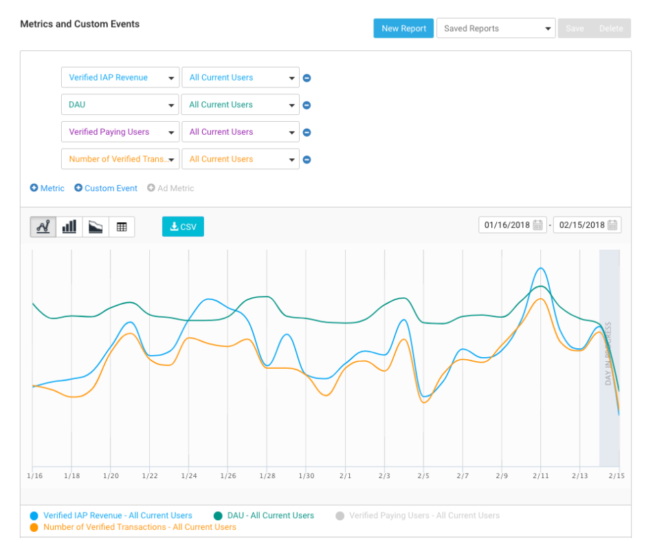
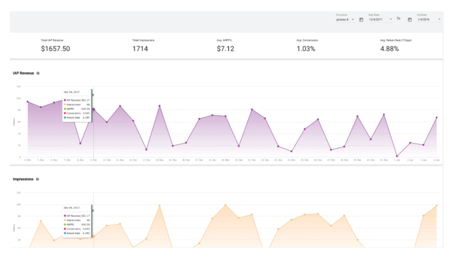

# IAP Promo best practices
## Make more money with IAP Promo
Take your monetization to the next level by promoting in-app purchases (IAPs) throughout the player lifecycle. [IAP Promo](https://docs.unity3d.com/Manual/IAPPromo.html) gives you this functionality for free, by serving existing Product offers to players as a new type of ad unit. Surfacing these promotions helps players discover your offers organically, rather than having to search for them in your game’s store. In this article, you’ll learn about three Promo strategies you can easily implement today to grow your IAP revenue.

## Promo strategies
### Awareness campaigns
If you’ve ever stood before a larger-than-life display of a double-foam latte drizzled with chocolate while waiting in line at a coffee shop, you’re already familiar with this technique and how effective it can be. The same concept can work wonders in your game. Surface existing Products at natural pauses to remind players of content that can enhance their experience.

### Progression unlock promotions 
These campaigns allow players to earn special offers by progressing in your game. The most common example is promoting a discounted starter pack when players complete a tutorial. These Promotions are very effective at encouraging first-time purchases, and encouraging repeat purchases when strategically employed at various progression milestones. 

### Seasonal specials
This classic retailer-inspired technique offers discounts around specific calendar dates, such as Halloween or Christmas. Many developers go even further, offering region-specific holiday specials, such as the 4th of July (USA only) or Chinese New Year (most Asian countries). 

## Setting up Promos
When configuring effective Promos, consider what constitutes the right offer at the right place and time.

### What
[This video](https://youtu.be/SGkzskwVMug) demonstrates how to get started immediately, using your existing [Product Catalog](https://docs.unity3d.com/Manual/IAPPromoProducts). However, don’t stop there; try creating discounted versions of each Product, so you have the option of using varying price points in special offers. A 20% discounted version is usually a good starting point. 

### Where
Use [Placements](MonetizationPlacements.md) to control where your game shows an offer. 

[Watch how](https://youtu.be/OSXAl82Ov9g) here.

### When
Once you’ve set up your Products and Placements, use them in any combination to create [Promotions](https://docs.unity3d.com/Manual/IAPPromoPromotions). 

[Watch it in action](https://youtu.be/Xbp38T6xis0) and learn how here.

### Putting it all together
So what might a successful Promotion look like? Here are some common examples for the aforementioned campaign types:

| **Campaign type** | **Placement(s)** | **Product(s)** | **Promotion criteria** |
| ----------------- | ---------------- | -------------- | ---------------------- |
| Awareness campaign | <li>Insufficient resources</li><li>End of level</li> | <li>Existing product</li> | <li>Start now</li><li>no end date</li> |
| Progression unlock | <li>Tutorial complete</li><li>Town Hall unlock</li><li>Any other game milestone</li> | <li>Discounted product</li> | <li>Start now</li><li>no end date</li> |
| Seasonal special | <li>Return to lobby</li> | <li>Discounted product</li> | <li>Specific start date</li><li>Specific end date</li><li>Specific regional targeting</li> |

## Incorporating a feedback loop
For best results, implement a predict, measure, and learn feedback loop. 

### Predict
Ask yourself: what metric will this new Promotion move and by how much? For example, maybe you predict that a starter pack offer will add a 5% increase in IAPs, as a result of increased awareness and investment at a more favorable price point. This estimate helps prioritize new Promotion ideas. 

### Measure
Use [Unity Analytics](https://docs.unity3d.com/Manual/UnityAnalytics.html) to measure results once a Promotion is live. Data Explorer enables you to drill down to specific changes. For example, plotting **Verified IAP Revenue**, **DAU**, **Verified Paying Users**, and **Number of Verified Transactions** on a single chart can help determine if an increase in revenue is actually coming from incremental purchases, as opposed to an influx of new users. 

Most developers run many promotions in parallel. Our Promo funnel report helps isolate results by illustrating performance at each step for a specific promotion. 

### Learn
Use these results to inform how you might improve the performance of your promotions. For example, if you’re seeing a steeper than expected drop-off between first impression and purchase conversion, consider using a different creative or Placement. If that funnel looks good, consider price changes to increase transaction size. 

Interested in learning more? In addition to the integration videos referenced throughout this article, we have more material to help you out: 

* [IAP Promo overview](https://docs.unity3d.com/Manual/IAPPromo) provides a high-level feature summary, and highlights its cutting edge machine learning function. 
* [Integration](https://docs.unity3d.com/Manual/IAPPromoIntegration) provides a step-by-step walkthrough for implementing IAP Promo in your game.
* [Placements](MonetizationPlacements.md) takes a deep-dive into the subject of Placements, and managing them through the Developer Dashboard.
* [Product Catalogs](https://docs.unity3d.com/Manual/IAPPromoProducts) explores how to create, import, and manage your catalog of Products using the Editor and Developer Dashboard.
* [Promotions](https://docs.unity3d.com/Manual/IAPPromoPromotions) covers how to use Products, Placements, and business logic to target the right audience with the right offer.

## What's next?
Learn how [Personalized Placements](MonetizationPersonalizedPlacements.md) harnesses machine learning, [ads](Monetization.md), and IAP Promos to lift your revenue to the next level.