# Operate dashboard guide
## Overview
The **Operate** tab of the [developer dashboard](https://operate.dashboard.unity3d.com/) provides tools to manage monetization across your Unity Projects. From the dashboard, you can configure [Placements](MonetizationPlacements.md), filters, test devices, [IAP Promos](https://docs.unity3d.com/Manual/IAPPromo.html), and revenue reports to maximize your earning potential.

### Guide contents
* [Org-level navigation](#organization-level-navigation)
    * Dashboard menu
    * Projects menu
    * Ads Data Export menu
    * Invoicing menu
* [Project-level navigation](#project-level-navigation)
    * Overview menu
    * Reporting menu
    * Monetization menu
    * Optimization menu
    * Analytics menu
    * Settings menu
* [Managing Projects](#managing-projects)
    * Adding Projects
    * Enabling an existing Project
    * Editing Projects
    * Archiving Projects

## Organization-level navigation
By default, you enter the dashboard at the Organization level (for more information, see [Unity Organizations](https://docs.unity3d.com/Manual/OrgsUnityOrganizations.html)). The information on the **Operate** landing page applies to your entire Organization, rather than a specific Project. 

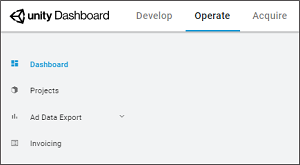

Use the left navigation bar to select your desired option.

### Dashboard
Select **Dashboard** from the left navigation bar to display your Organization’s at-a-glance revenue report. You can view statistics on **Total Revenue**, **Total DAU** ([daily active users](https://en.wikipedia.org/wiki/Daily_active_users)), or **Total New Users** across all the Organization’s Projects. You can also filter the data by platform or date range.

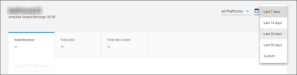

### Projects
Select **Projects** from the left navigation bar to view a list of your Organization’s Projects. The list view provides at-a-glance information about each Project’s **Total Revenue**, **Ad Revenue**, **New Users**, **DAU**, and **ARPDAU** (average revenue per daily active user).

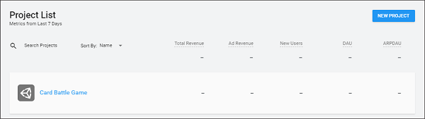

Select any Project from the list to manage that Project’s operations settings (see section on [**Project-level navigation**](#project-level-navigation)).

For more information, also see section on [**Managing Projects**](#managing-projects).

### Ads Data Export
#### Email & CSV
Select **Ads Data Export** > **Email & CSV** from the left navigation bar to export a monetization report for your Organization. 

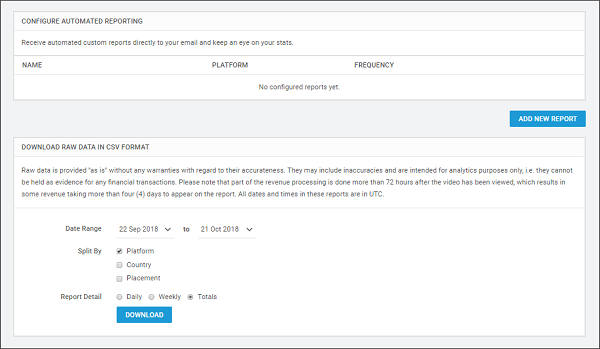

For more information on configuring reports, see documentation on [Monetization statistics](MonetizationResourcesStatistics.md).

#### Test Devices
Select **Ads Data Export** > **Test Devices** from the left navigation bar to register an iOS or Android device for testing your Unity Ads or IAP integration without monetizing the device. 

**Important**: This is important for testing integration in unpublished games, to avoid being flagged for fraud. 

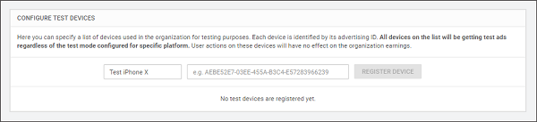

Enter your device's name in the first input field, and your IDFA (ID for advertising) in the second input field. For more information on locating your device's IDFA, see documentation on [how to find your mobile device identifiers](https://www.mparticle.com/blog/how-to-find-your-mobile-device-identifiers).

#### API Access
Select **Ads Data Export** > **API Access** from the left navigation bar to locate your Organization’s API key. This key is required for generating reports through the [Monetization statistics API](MonetizationResourcesStatistics.md#using-the-monetization-stats-api).

### Invoicing
Select **Invoicing** from the left navigation bar to configure [automated payouts](MonetizationResourcesRevenueAndPayment.md#automated-payouts). For more information, see documentation on [revenue and payment](MonetizationResourcesRevenueAndPayment.md).

## Project-level navigation
Select a Project to drill down into that Project’s dashboard settings. 

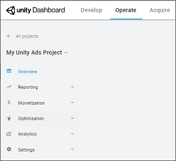

Use the left navigation bar to select your desired option.

### Overview
Select **Overview** from the left navigation bar to display your Project’s at-a-glance revenue report. You can view statistics on **Total Revenue**, **Average DAU** ([daily active users](https://en.wikipedia.org/wiki/Daily_active_users)), or **Day 1 Retention** across all the Organization’s Projects. You can also filter the data by platform or date range.

### Reporting
#### Ad Revenue Report
Select **Reporting** > **Ad Revenue** from the left navigation bar to view a breakdown of ad revenue for your Project. 

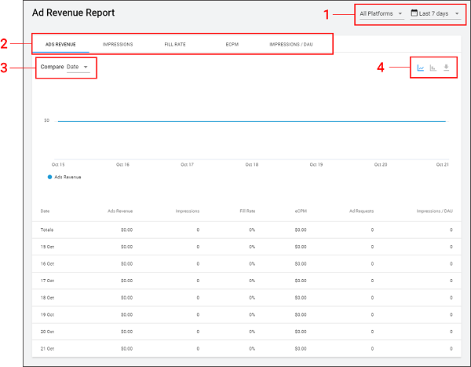

There are several ways to refine your report:

1. Filter data by platform, or date range.
2. Select the desired metric to visualize the data as a chart.
3. Change the comparison field to split data across different categories and compare the splits:
    * **Compare Date** plots ad revenue for each day from the selected date range.
    * **Compare Platform** plots ad revenue for each platform (**Google Play Store**, **Apple App Store**, and **Others**) against each other.
    * **Compare Country** plots ad revenue for each country (**Australia**, **Canada**, **China**, **Germany**, **France**, **United Kingdom**, **Japan**, **South Korea**, **Russia**, **Taiwan**, **United States**, and **Others**) against each other.
    * **Compare to previous period** plots ad revenue for the current date range against ad revenue from the preceding equivalent date range.
    * **Compare Placements** plots ad revenue for each [Placement](MonetizationPlacements.md) against each other.
    * **Compare All Projects** plots ad revenue for the current Project against your Organization’s other Unity Ads-enabled Projects.
4. Choose whether to view data as a spline chart, bar chart, or to export data as a CSV file. 

#### IAP Purchases
Select **Reporting** > **IAP Purchases** from the left navigation bar to view a breakdown of In-App Purchasing ([IAP](https://docs.unity3d.com/Manual/UnityIAP.html)) revenue for your Project. 

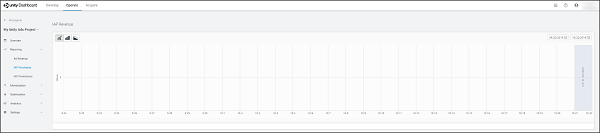

You can filter data by date range, and display it as a spline chart, bar chart, or stacked chart.

#### IAP Promotions
Select **Reporting** > **IAP Promotions** from the left navigation bar to view analytic insights for your Project’s [IAP Promo](https://docs.unity3d.com/Manual/IAPPromo.html) performance. For more information on configuring Promos, see documentation on  [IAP Promo integration](https://docs.unity3d.com/Manual/IAPPromoIntegration.html).

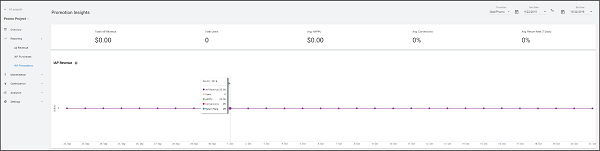

You can filter the following metrics by Promotion and date range: 

* **IAP Revenue**: The cumulative revenue generated from Promo offers.
* **Users**: The number of users exposed to Promo offers.
* **ARPPU**: The [average revenue per paying user](https://en.wikipedia.org/wiki/Average_revenue_per_user).
* **Conversions**: The percent of exposed users that purchased the offer.
* **Return Rate (7 days)**: The 7-day retention of users after exposure to a Promo offer.

Hover over any metric breakdown in the timeline to view the full data for that day.

### Monetization
#### Placements
Select **Monetization** > **Placements** from the left navigation bar to create and manage Placements for your Project. For more information, see documentation on [Placements](MonetizationPlacements.md). 

#### Ad filters
Select **Monetization** > **Ad Filters** to refine your ad strategy by targeting specific demographics with specific content. 

**Note**: While ad filters are often advantageous, blocking content categories or applying age limits can negatively impact your revenue by creating a smaller pool of bidders. For more information on this trade off, please read our [ads best practices guide](MonetizationResourcesBestPracticesAds.md).

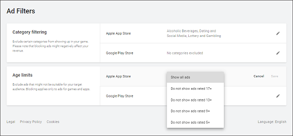

**Category filtering**
Click the Edit icon to edit category exclusions for each platform. Check the categories you wish to include, then click **Save** to confirm your settings.

**Age limits**
Click the Edit icon to specify the appropriate age limit for your game on each platform. Advertisements targeting older audiences will not be allowed to bid on your impressions. Click **Save** to confirm your settings.

If you have additional questions or unique requests regarding ad filtering, [contact Unity Ads support](mailto:unityads-support@unity3d.com).

#### In-App Purchases
Select **Monetization** > **In-App Purchases** from the left navigation bar to import and manage IAP Product Catalogs for your Project. For a complete guide, see documentation on [Product Catalogs](https://docs.unity3d.com/Manual/IAPPromoProducts.html). 

#### IAP Promotions
Select **Monetization** > **IAP Promotions** from the left navigation bar to create and manage IAP Promos for your Project. For a complete guide, see documentation on [Promotions](https://docs.unity3d.com/Manual/IAPPromoPromotions.html). 

### Optimization
Use unique features from [Unity Analytics](https://docs.unity3d.com/Manual/UnityAnalytics.html) to fine-tune your games. 

#### Tutorial Manager (Beta)
Tutorial Manager adapts your game’s tutorial to individual players. Whether they're seasoned veterans or brand new, Unity serves an experience that's right for the player – leading to better retention for your game.

For more information on using Tutorial Manager, click **CONTACT US TO LEARN MORE** and fill out the web form.

#### LiveTune (Beta)
LiveTune allows you to deliver optimal quality and frame rate performance on any device by dynamically adjusting your content’s complexity. In LiveTune, you group your performance and quality settings into scalable tiers and LiveTune automatically finds the optimal quality level for every device, enabling performance and quality optimization at scale for thousands of devices.

For more information, see beta documentation on [LiveTune](https://unitytech.github.io/livetune-plugin/).

#### A/B Testing (Beta)
Conduct A/B tests to improve your game. Choose the best settings based on data. Gain the insight you need to make superior decisions.

For more information, see documentation on [A/B testing](https://docs.unity3d.com/Manual/UnityAnalyticsABTesting.html).

#### Remote Settings
Use Remote Settings to control properties in your game from the dashboard. You can change game appearance and behavior without needing to release an application update.

For more information, see documentation on [Remote Settings](https://docs.unity3d.com/Manual/UnityAnalyticsRemoteSettings.html).

### Analytics
Use [Unity Analytics](https://docs.unity3d.com/Manual/UnityAnalytics.html) to evaluate and improve your game through data.

For a detailed breakdown, see documentation on the [Analytics dashboard](https://docs.unity3d.com/Manual/UnityAnalyticsDashboard.html).

### Settings 
#### Project Settings
From the left navigation bar, select **Settings** > **Project Settings** to view and configure operational settings for your Project.

#### Game IDs
You need the __Game ID__ for each platform to [initialize the Unity Ads](MonetizationBasicIntegrationUnity.md#initializing-the-sdk) and [Unity IAP](https://docs.unity3d.com/Manual/UnityIAPInitialization.html) SDKs in your code. You cannot edit these IDs.

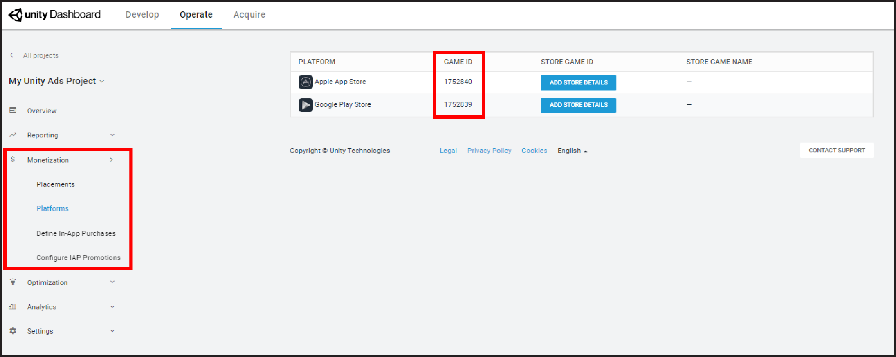

#### Project info
Find the following properties for your Project here:

* **Project name** is the name of your Project. Though you cannot edit this setting here, Organization __owners__ can do so by navigating to the [Develop dashboard tab](https://developer.cloud.unity3d.com/), then selecting **Settings** > **General**, and following the prompts to rename your Project. 
* __Project ID__ is a unique identifier for your Project. 
* **Age designation** indicates whether your Project is directed at children under the age of 13 in the United States (required for [COPPA](https://www.ftc.gov/enforcement/rules/rulemaking-regulatory-reform-proceedings/childrens-online-privacy-protection-rule) compliance). If you need to change your COPPA compliance designation, please [contact Unity Ads support](mailto:ads-support@unity3d.com).

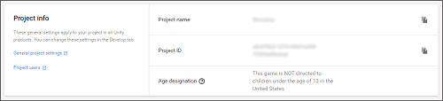

#### Store IDs
Optionally link your Project to live Store IDs for the game’s Apple or Google Play app page. Skipping this step does not prevent you from showing ads, however, some of Unity's advertising partners require this information. In order to maximize revenue opportunities, please make sure you include it when your game is live.

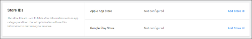

Extract the **Apple App Store ID** from your game’s URL, as shown in the highlighted section of the following URL:

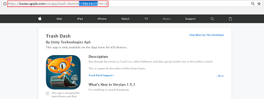

Extract the **Google Play Store ID** from your game’s URL, as shown in the highlighted section of the following URL:

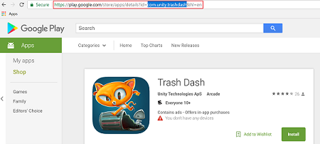

**Note**: If you recently published your app, Unity may be unable to look up its ID. Should you encounter this error, please try again 5-7 days after the publish date.

#### Test mode
Test mode allows you to test your integration without serving live ads. Use this setting to override programmatic settings on a device, by toggling **Override client test mode**, then checking **Force test mode ON (i.e. use test ads) for all devices**. It is important to enable test mode before testing integration to avoid getting flagged for fraud.

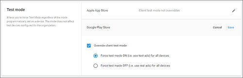

#### Ad delivery status
The **Enable ad delivery** toggle allows you to temporarily stop serving ads to your application.

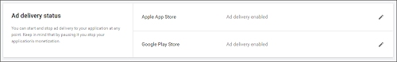

### Analytics Settings
Access settings that are specific to managing your Unity Analytics data. 

For more information, see documentation on [Analytics settings](https://docs.unity3d.com/Manual/UnityAnalyticsDashboardConfigure.html). 

## Managing Projects
To manage Projects, navigate to the **Operate** tab of the [Developer Dashboard](https://operate.dashboard.unity3d.com/organizations), and ensure no Projects are selected. Select **Projects** from the left navigation bar to view a list of your Organization’s Projects.

### Adding Projects
Click **NEW PROJECT** to create a Project under your selected Organization.

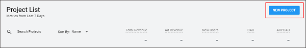

Enter the following information in the **Add new project** prompt:

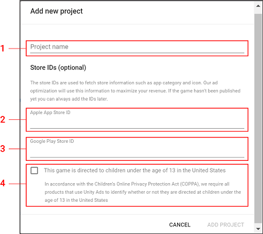

1. **Project name** is the title displayed for your Project in the dashboard.
2. **Apple App Store ID** is optional, but recommended for published games to maximize access to third-party advertising partners.
3. **Google Play Store ID** is optional, but recommended for published games to maximize access to third-party advertising partners.  **Note**: You can always add store IDs later by selecting the Project, then **Monetization** > **Platforms** > **ADD STORE DETAILS**. For more information on locating the relative store IDs, see section on [store IDs](#store-ids).
4. Check the COPPA compliance designation if your game will target an audience under 13 years old in the United States. 

Click **ADD PROJECT** to create your Project. Projects created in the Developer Dashboard automatically enable the Operate services.

### Enabling an existing Project
Projects created in the Unity Editor do not enable Operate services by default. If a Project’s Operate services are not enabled, selecting them on the dashboard Projects list will prompt you to do so. 

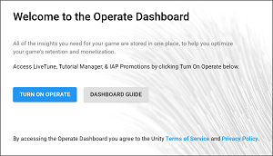

Click **TURN ON OPERATE**, then set the app store IDs and COPPA compliance designation appropriately to enable services.  

### Editing Projects
To edit your Project name or [transfer it to a different organization](https://support.unity3d.com/hc/en-us/articles/213524303-How-do-I-transfer-my-Project-to-a-different-Unity-Organization-), navigate to the **Develop** tab of the [developer dashboard](https://developer.cloud.unity3d.com/), then select **Settings** > **General** from the left navigation bar.

### Archiving Projects
This [help article](https://support.unity3d.com/hc/en-us/articles/115000075126-How-do-I-archive-a-Project-) details how to archive old Projects that are cluttering your dashboard, and how to view or change the status of archived Projects.

## What's next?
View documentation on [revenue and payment](MonetizationResourcesRevenueAndPayment.md) to start earning money from Unity Ads.