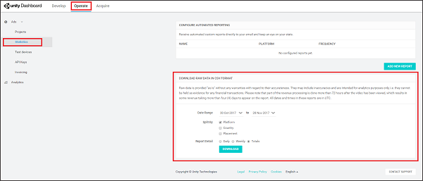
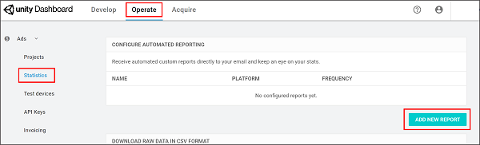
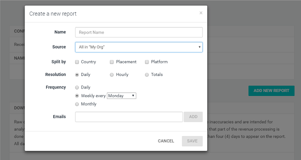
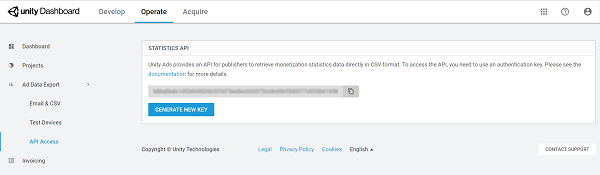

# Monetization Statistics API
## Overview
Unity Ads provides robust reporting tools for analyzing your monetization metrics. There are three reporting methods, outlined below:

* Downloading [raw CSV data](#downloading-raw-csv-data) through the Statistics section of the [developer dashboard](https://operate.dashboard.unity3d.com)
* Configuring [automated reports](#configuring-an-automated-report) through the Statistics section of the [developer dashboard](https://operate.dashboard.unity3d.com)
* Using the Monetization [Stats API](#using-the-monetization-stats-api)

## Downloading raw CSV data
To generate a CSV report for your Organization:

1. From the **Operate** tab of the [developer dashboard](https://operate.dashboard.unity3d.com), select **Statistics** from the left navigation bar.
2. Under the **DOWNLOAD RAW DATA IN CSV FORMAT** section, configure the parameters of your report. Specify the date range, data split (by platform, country, and placement), and granularity of statistics reported.
3. Click the **DOWNLOAD** button.



To generate a CSV report for a specific Project, select your Project from the left navigation bar before following the same steps. For more information on Organization- and Project-level dashboard navigation, read the [dashboard guide](MonetizationResourcesDashboardGuide.md)

## Configuring an automated report
To create automated reports on a specified cadence: 

1. From the **Operate** tab of the [developer dashboard](https://operate.dashboard.unity3d.com), select **Statistics** from the left navigation bar.
2. Under the **CONFIGURE AUTOMATED REPORTING** section, click the **ADD NEW REPORT** button.<br><br>
3. In the configuration prompt, name the report, then set how to split the data (by country, placement, or platform) and how often you want to generate the report. Finally, enter the email addresses (separated by commas) to receive the reports.<br><br>

## Using the Monetization Stats API
Many developers may prefer the customization of the Stats API, which allows you to retrieve monetization data directly in CSV format. The API fetches the same statistics that are available on the developer dashboard, however you can use it to programmatically pull data for your own uses.

The statistics API works in two stages:

1. The user performs a [`GET` request](https://en.wikipedia.org/wiki/Hypertext_Transfer_Protocol#Request_methods) to an authentication server. After successful authentication, the server responds with a `302 HTTP` redirect message, which contains the final URL to the statistics server.
2. When the user performs a `GET` request to the signed URL, the server responds with the requested data in the body of the message in CSV format.

### Authentication
The API uses a key from the developer dashboard. To find it:

1. From the **Operate** tab of the [d]eveloper dashboard](https://operate.dashboard.unity3d.com), ensure that you are viewing you Organization dashboard (in other words, no specific Project is selected).
2. Select **Ad Data Export** on the left navigation bar to expand its options, then select **API Access**.


 
You must include the API Key in the authentication GET request, as the `apikey` parameter.

After successful authentication, the server responds with a 302 HTTP redirect message. Obtain the redirect URL from the `Location` HTTP header.
 
The redirect URL fetches the data. This is standard HTTP behavior that is supported by all HTTP clients. For example, the following request directly outputs the file to the console: 
 
```
curl -L 
"https://gameads-admin.applifier.com/stats/monetization-api?apikey=APIKEY" 
``` 

To retrieve data from the statistics server, you must use a valid URL signature. If the authentication fails, the authentication server responds with an HTTP/1.1 200 OK header, and an error message in the body:
 
```
{"error":"Authentication error","responseCode":500,"status":"error"}
```

### Request Format
Use the following request format:

```
https://gameads-admin.applifier.com/stats/monetization-api?apikey=<apikey>&fields=<fields>[&splitBy=<splitbyfields>][&scale=<scale>][&start=<startDate>][&end=<endDate>][&sourceIds=<sourceIds>]
```

For Example:

```
curl -L 
"https://gameads-admin.applifier.com/stats/monetization-api?apikey=1234567890abcdefghijk1234567890lmnopqrstuvwxyz&splitBy=zone,country&fields=adrequests,available,views,revenue&start=2016-01-01&end=2016-10-01&scale=day&sourceIds=1234567" > ~/Desktop/UnityAdsMonetization.csv
```

### Splitting data
To split your data, specify the following parameters:

| **Parameter**  | **Description** |
| -------------- | --------------- |
| `<apikey>` | The API authentication key retrieved from the developer dashboard. |
| `<fields>` | A comma-separated list that defines the columns of available fields:<br><br><ul><li>`adrequests`</li> <li>`available`</li> <li>`started`</li> <li>`views`</li> <li>`revenue`</li> <li>`platform`</li> <li>`all`</li></ul><br>**Note**: If you leave the value empty, the parameter defaults to `all`. For detailed descriptions of each metric, see section on [understanding Unity Ads metrics](#understanding-unity-ads-metrics) below. |
| `<splitbyfields>` | A comma-separated list that expands the rows, splitting data by the following fields:<br><br><ul><li>`source`</li> <li>`zone`</li>	<li>`country`</li></ul><br>**Note**: zone refers to Placement. If you leave the value empty, the parameter defaults to `country`. Use `splitBy=none` if you do not want to split your data. |
| `<scale>` | A value that splits data by time resolution. Each day splits at 00:00 UTC.<br><br><ul><li>`hour`</li> <li>`day`</li> <li>`week`</li> <li>`month`</li> <li>`quarter`</li> <li>`year`</li> <li>`all`</li></ul><br>**Note**: `all` removes time resolution splitting, returning the total values within the specified time period. If you leave the value empty, the parameter defaults to `day`. | 
| `<start>` & `<end>` | The start and end times of each data set.<br><br>**Note**: Negative numbers indicate days relative to the current date (for example, `“start=-7”` denotes 7 days ago). The date string uses [ISO format](https://en.wikipedia.org/wiki/ISO_8601) (for example, `2017-12-17T14:00:00.000Z`). Start and end dates round to the next full hour (for example, `14:00:05.000Z` rounds to `15:00:00.000Z`). |
| `<sourceIds>` | A comma-separated list of Game IDs by which to filter results.<br><br>**Note**: By default, this parameter returns all relevant IDs. For example, `sourceIds=1234567` filters results to only show data associated with this Game ID. | 

**Note**: Splitting data across multiple dimensions causes the CSV to grow exponentially, which might cause some large data sets to time-out. The request times out if the server takes more than 60 seconds to process the request.

For additional questions regarding the Monetization Statistics API, please [contact support](mailto:unityads-support@unity3d.com).

## Understanding Unity Ads metrics
### Terminology
#### Ad request
The game client makes an ad request to the Unity Ads network during SDK initialization. If an ad is available, the ad caches and the server tallies a received request. When a player views the cached ad, the game client sends a new request.

#### Ad start (see also, Impressions)
An ad start counts when a video begins playing. This is more commonly called an impression. The quality of impressions generated by your game dictates how much revenue you earn.

#### Available
An available ad refers to a successful response to an ad request.

#### eCPM (effective Cost Per Mille)
eCPM is the average revenue your game earns per 1000 impressions. This value depends on the bids of the ads shown in your game and their overall performance; you can think of it as a general representation of how valuable your ad space is to advertisers. 

#### Fill rate
Fill rate is the rate of available ads served divided by the number of ad requests. Unity Ads generally has a 95%+ fill rate, though several factors such as region and player base may mitigate this.

Unity Ads has a global fill rate of greater than 95%, but some regions outside of America and Europe that might have smaller ad pools won't always have ads available. It's important to check whether ads are available before showing ads to your users.

For more tips on maximizing impressions, read the [ads best practices guide](MonetizationResourcesBestPracticesAds.md). If you are interested in further restricting the maximum number of ads users can view, please contact Unity Ads support. 

#### Impressions (see also, Ad start)
Impressions indicate the number of times an ad is fetched from the server, and tally every time a video begins playing. Impressions earn revenue, however, the quality of impressions vary (see section on interpreting the data, below). 

#### Views
A view counts when a player watches a video ad to completion.

### Interpreting the data
The following section details some useful relationships between data points to consider.

#### Ad requests with no ad starts
Test mode may cause this issue. Check to ensure you’ve disabled it. 

#### Low eCPM
This number reflects a blend of the volume and quality of impressions your game provides; consider reviewing your integration design and marketing strategy. The following user interaction types are listed in escalating order of quality and earning potential:
 
1. Ad start (the player triggers an ad)
2. Completed view (the player watches an ad to the end)
3. Click (the player clicks the ad, leading to an external product link)
4. Install (the player clicks out to the external product page and installs the product) 

Keep this in mind as you consider your monetization strategy. Please review the [ads best practices guide](MonetizationResourcesBestPracticesAds.md) for more integration tips.

#### Low impressions-to-ad requests ratio
A low ad requests ratio can indicate that the Ads SDK is initializing more often than users are viewing ads in your game. An ad request counts when the SDK initializes using your Game ID and requests an ad from the network, which returns an ad for caching. If those ads are never viewed, consider the following tweaks to your integration design: 

* Provide increased or more prominent opportunities for players to view ads.
* Provide stronger incentives for players to opt into rewarded ads. 

Please review our Best practices guide for more integration tips.

#### No ad requests, starts, or views (blank report)
Double-check that the Ads Delivery Service is turned on, and that you’re calling the correct Game ID when initializing Ads.

## What's next?
View documentation on [rewarded ads best practices](MonetizationResourcesBestPracticesAds.md) to get the most out of your implementation.